ctrl+b //to hide sidebasr

ctrl+c to quit terminal

React is a library and not framework. frameworks hav very strict rules and syntaxes but react is cool guy

vite and parcel ek bundler jo bhut sare js files ko combine krke basic aapko 1 file de deta ha

If you want to build mobile apps using React Native along with react, you'll need to learn both React and React Native, but focus more on React Native.

 If your goal is web development, use React with react-dom libraray

**Three.js** is a JavaScript library used to create and display **3D graphics** in a web browser.

follow below codes while setting a new fldr

echo : used to create a new file

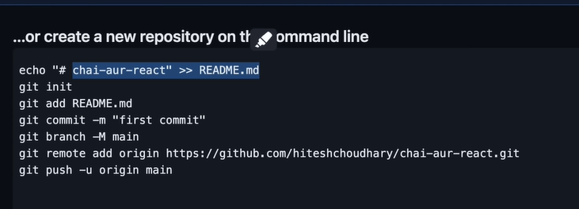

**`npm`** (Node Package Manager) is used to install, update, or manage Node.js packages globally or locally, while **`npx`(node package executor)** is a tool to execute Node.js packages directly without globally installing them. For instance, you can run a package temporarily with `npx` without cluttering your system, making it ideal for tools like `create-react-app`. In short, `npm` manages packages, and `npx` runs them on-demand.

below method is slower to create app

`create-react-app` is a software or utility but it is very bulky software so not preffered to use, so instead we use **vite and parcel**,they are also utilities like `create-react-app`

## package.json

it is the entry point to understand any react app structure

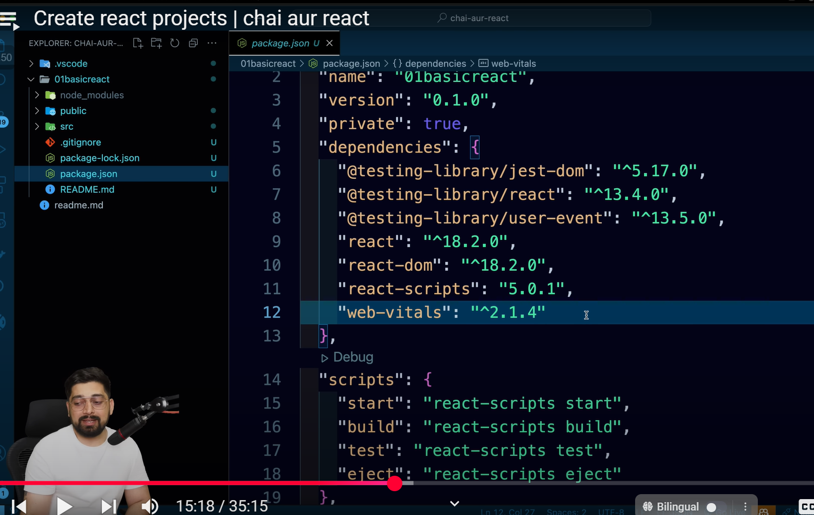

web vitals track the speed of perfomnce of react apps

The script in the context of a React project refers to the **commands** defined in the `package.json` file under the "scripts" section. These scripts are used to run specific tasks like starting the development server, building the project for production, running tests, or ejecting configurations.

1. **Start Script** : `npm start` runs your application in a development environment. It launches the development server and enables hot reloading to see changes instantly.

   ***Hot Reloading** means that when you make changes to your code, those changes are automatically updated in the running application  **without needing to refresh the page** . This feature is commonly used in development environments, especially in frameworks like React.*
2. **Build Process** : The `npm run build` command creates a production-ready version of your application. Since the browser understands only HTML, CSS, and JavaScript, this process compiles React components into optimized static files that browsers can interpret.
3. **Test Script** : `npm test` runs the test cases in your project to ensure functionality is correct.
4. **Eject Script** : `npm run eject` exposes the underlying configuration (e.g., webpack, Babel) used by Create React App. This is useful if you need to customize the setup but should be used cautiously since it makes the configuration harder to manage manually.

In essence, these scripts streamline project tasks and manage the development, testing, and production workflows efficiently.

---

project chalane ke lie start script is used..

note: har script start, build etc ke sath run use kro, u could also write just npm start

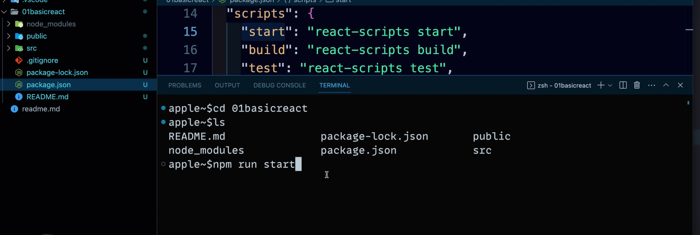

---

 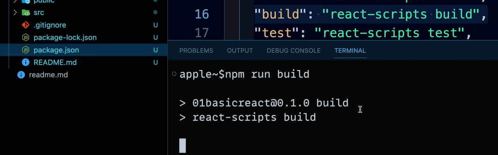

by writing npm run build we get a new 'build' flder in which we get all the js code that we had written in our react app..when project is taken to production this build fldr is only served to all users and not the source fldr

The **build folder** in a React project (or similar frameworks) is the output of the production-ready code created by the  **build process** . When you run the command `npm run build`, the project is compiled, optimized, and bundled into files that browsers can understand—HTML, CSS, and JavaScript. (**JavaScript files** : Bundled React components and libraries compiled into a few `.js` files.)

## we will be using Vite always to create react-app

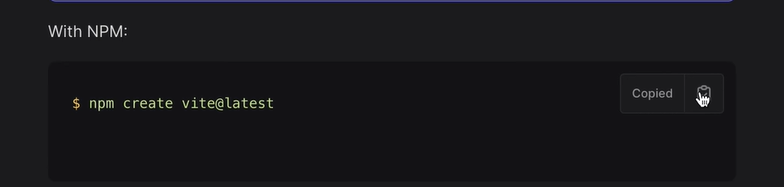

vite,swelt are just another bundler that creates react app

* **React** : A library used for building user interfaces.
* **Vite** : A modern build tool and development server that optimizes the development workflow for JavaScript-based frameworks like React.
* 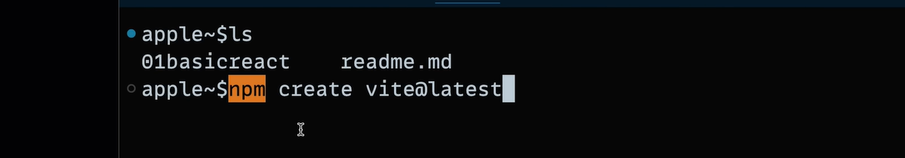

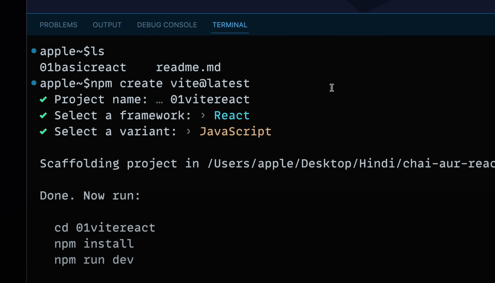

---

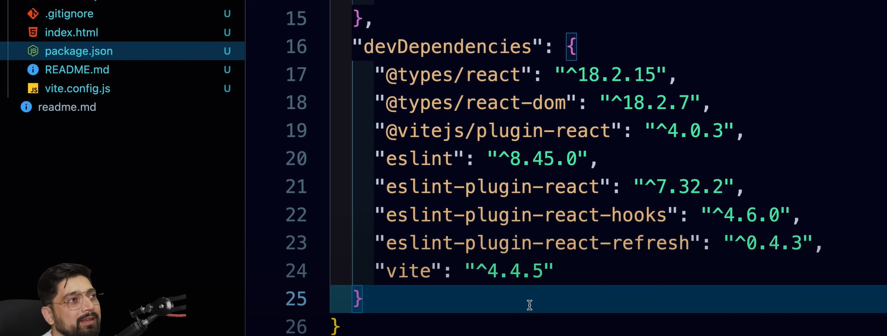**Dev dependencies** are packages or libraries that are required only during the development process and are  **not included in the final production build** . These dependencies help with tasks like testing, bundling, transpiling, and code linting during development but are not needed for the application to run in production.

* node modules are not given with vite.so we need to install thm using npm i
* 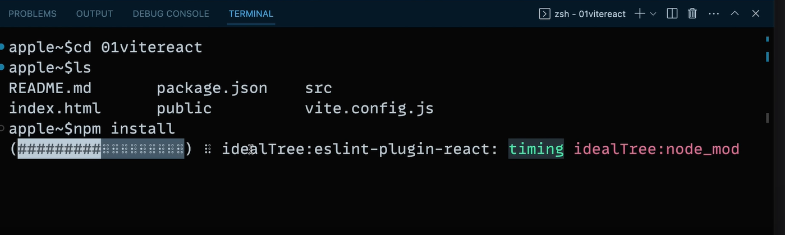

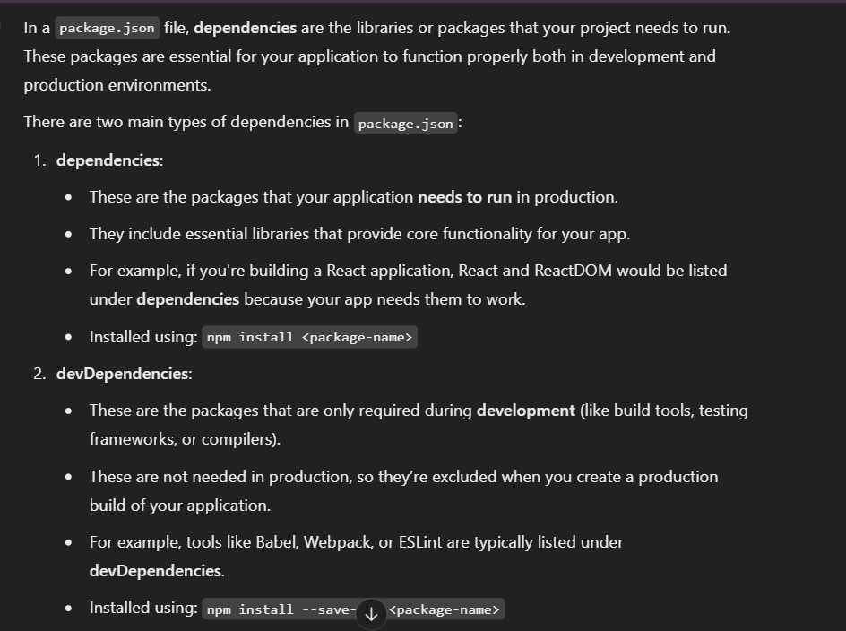

***More dependencies** mean more code needs to be bundled and served to the browser. Larger bundle sizes can lead to slower initial page load times as the browser has to download and parse more files.*

To run app:

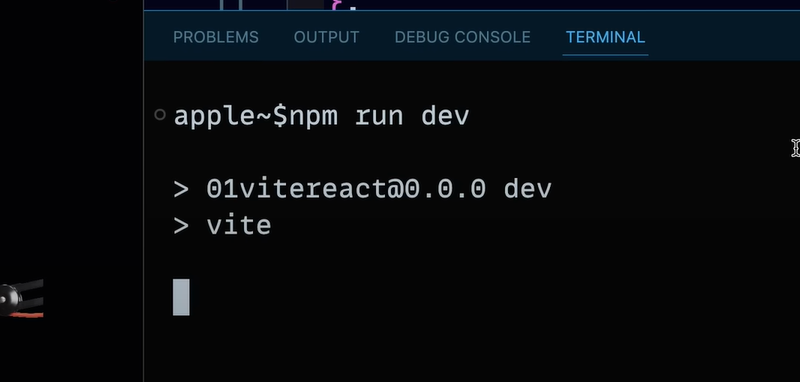

in every react and vite app we are given Readme.md .do update it accordingly

---

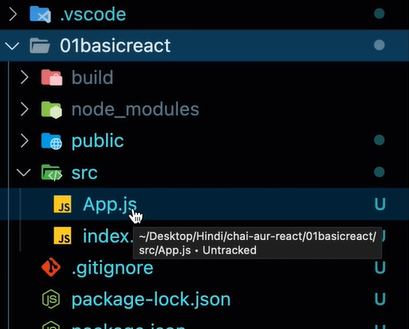

---

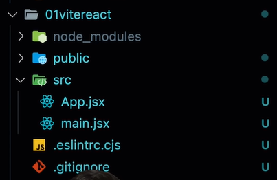

only above shown files in src must be kept and delete the rest

jsx is html with js

#### Cleaning the code is VIMP✨

when u  make new react or vite app, jo bhi kam ke above files ha unme jo bhi likha ha ,usme jo bhi tumko samajh nhi aa rha sabko remove krdo to make a simple file

---

# Video 3

understanding structure of flder:

build is completely ignored

package.lock.json : means packagees get locked.ie. all the given dependencies will run in the given versions only.inme koi stable version ko lock kr diya jata ha

public fldr ke manifest.json files are used for mobile when apps are opened in them

robots.txt is for refernce for search engines

# explantion of index.js file in 01basicsreact App

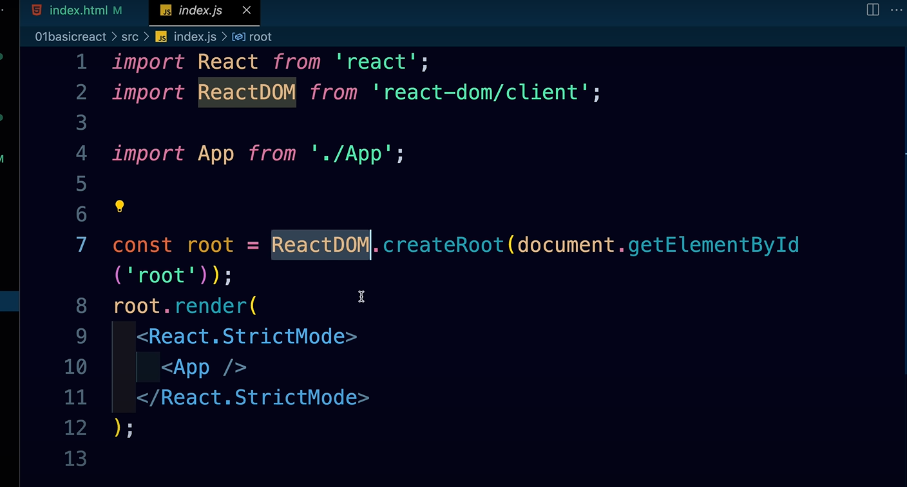

React is SPA single page applictin since we have only 1 index.html file to be loaded

we can change name of index.js file to shakti.js also

in index.js we importe 2 libarires react and react-dom as only they both are used to manipualte the dom of web

react-dom is an implemtation of react specifically for web

react khud ka webpage ke lie apna dom banata ha called as React.DOM

###### jo bhi script files ha wo pacakge.json ke react-scripts se html file se automatically attach ho jati ha

The `index.html` file has a `
` with an `id` (usually `root`). React injects the entire app into this `
`.

If you open your browser's **Page Source** (by right-clicking and selecting "View Page Source"), you’ll notice:* A `<script>` tag that references JavaScript bundles (e.g., `static/js/main.bundle.js`).These bundles are automatically added by CRA during the build process.

React's dynamic behavior is what makes the page interactive. The static `index.html` file acts as the skeleton, while React scripts (bundled JavaScript) dynamically populate the content in the `
` and other parts of the DOM.

* **App.js ---> data/fxns are fetched ---> index.js ----> exports to  root div of -----> index.html**

# explantion of index.js file in 01ViteApp

jsx and js files are same only...bas components ko alag se mention ke lie jsx files are used

vite and create react app ka flder structure me lagbhag same hi kam hota ha bas vite thora lite weight ha

vite se appliction banane wakt componnts hv to be kept in .jsx file bcoz vite has its own rules. nbut in case of create react app(CRA) we can name it as both .js or .jsx

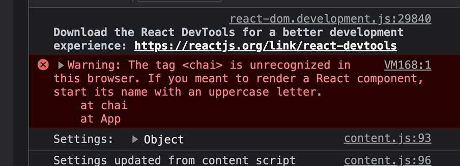

keep the name of componnts start with capital. these are best practices. file ki names upper ya lower case me ho skti ha

component.jsx-----> App.jsx ----> main.jsx -----> index.html

//the index.html has main.jsx script file attached to it

##### jsx files hav rule that they can return only 1 elmnt..could do like shown below:

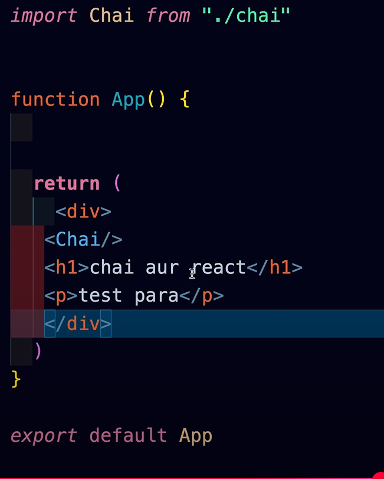

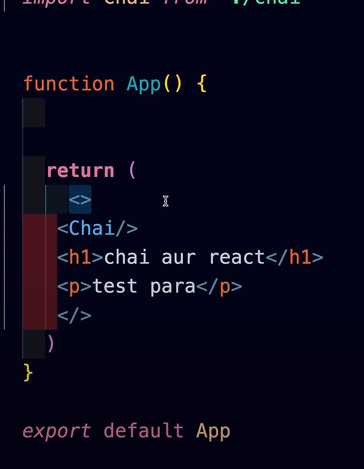

<></> called a fragment

### notes:

1. the fxns that we are exporting in either .js or .jsx files are called as components
2. the name of these componnt fxns should start with capital in both CRA and vite...even capitalize first letter of file name of compnnts also
3. 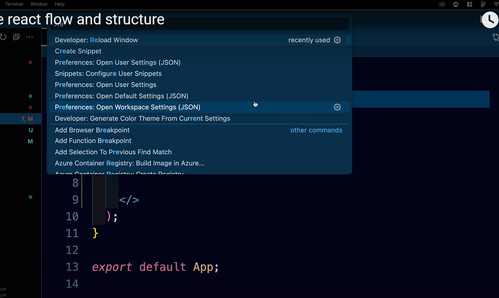
4. above can be used to reload window
5. some libraries like vite will force to keep file names as .jsx if they return html --> u can also follow this basic convention for CRA
6. react apna ek virtual dom banata ha parallel to the browser's dom
7. we hv only 1 index.html so react is called SPA
